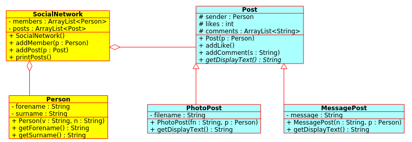

# AUFGABE socialnetwork 1

- gegeben: Klassendiagramm: socialnetwork 1
- gesucht: cpp-Programm

---

## given: uml-socialnetwork1.png



---

## lab
1. given: main.cpp
2. please code: person.h, ...
  
---

## output (must)


``` bash
MESSAGE-POST:
"What is the best coding language?" by Max Teacher, 3 likes
   comment: Java, java, java
   comment: I agree

MESSAGE-POST:
"I like to design software!" by Susi Student, 1 likes
   comment: software testing is coooool?

PHOTO-POST:
"teacher1.jpg" by Max Teacher, 0 likes
```

---

## build

``` bash
mkdir build
cd build
cmake ..
make
./main
```
