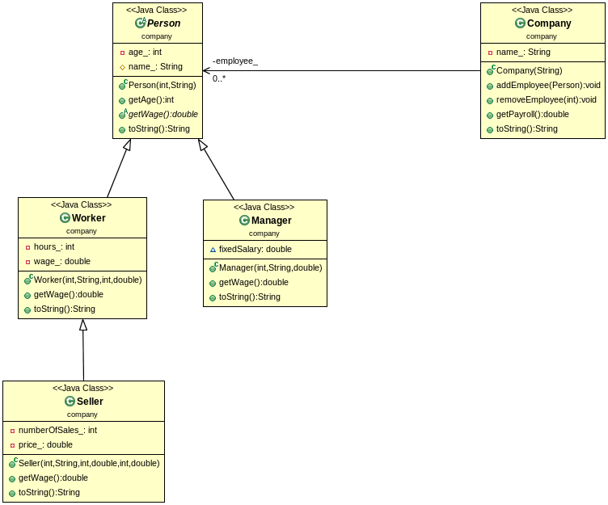
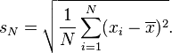

# CLIL-JAVA: OOP-Project Company

File:<https://gitlab.com/4me/courses/blob/master/CLIL/JAVA/AB-JAVA-OOP-03-company.md>

## Topic:	
	a) Inheritance
	b) Polmorphism


## What you should know
	baseclass
		aka "super class". Shares all its members with its subclasses.
		We call this reuseability.

	subclass
		gets all members of its baseclass(es) and implements additional
		so called "subclass specific members".
		Inhertied members can be overridden by the subclass.


	private, public, protected:
		private members can only be accessed by the class itself.
		proteced members can be accessed by the class and all its subclasses.
		public members can be accessed by every class.


	abstract class
		???????? INSERT YOUR Answer here.????????????
	polymorphism,
		???????? INSERT YOUR Answer here.????????????


## Inheritance

### LAB: Person - A base class
* create a baseclass Person that holds name and age of a person.
* create a small test-program

```java
	public class Person{
		    // Private member. Nobody can access this member
		private int age_;
		   // Protected member. 
		   // Only subclasses can access this member
		protected String name_;

		public Person(int age, String name){...}

		   // getter/setter
		public int getAge() {...}
	
		public String toString() {...}
	}
```

### LAB: Worker - A first subclass

* create the subclass Worker that inherits all from its baseclass Person.
* create a small test-program

```java
	public class Worker extends Person {
		private int hours_;
		private double wage_;

		public Worker( int age, String name, 
				    int hours, double wage ){...}
					    
		// getter/setter
		// Question: is this really necessary?????
		public int getAge() {...}
		public double getWage() {...}

		public String toString() {...}
	}
```

### LAB: Test - Person, Worker
* test your classes with the following code

```cpp
// Person
//     Worker

	Worker me= new Worker(80, "Jack Oldman", 40, 50.0);

	System.out.println("\n********************************************");
	System.out.println ( me.toString() );

	System.out.println ( "My age: " + me.getAge() );
 	System.out.println ( "My wage: " + me.getWage() );


	System.out.println ( "\n********************************************");
	Worker you= new Worker(20, "George Jungman", 20, 25.0);

	System.out.println ( you.toString() );

	System.out.println ( "Your age: " + you.getAge() );
	System.out.println ( "Your wage: " + you.getWage() );

```

The output should look like:

	********************************************
	Name= Jack Oldman, Age= 80
	  hours= 40 wage= 2000.0

	My age: 80
	My wage: 2000.0

	********************************************
	Name= George Jungman, Age= 20
	  hours= 20 wage= 500.0

	Your age: 20
	Your wage: 500.0


### LAB: Seller, Manager - Add two subclasses

* create class Seller as a subclass of Worker
* create class Manager as a subclass of Person
* test your classes (see above)

Seller: "is a Worker"
	private int numberOfSales_;
	private double price_;

	public:
		constructor
		getWage()	// like a work plus numberOfSales*price
		toString()
		getAge()   // do you really have to implement this method?


Manager: "is a Person" 
	private double fixedSalary_;

	public:
		constructor
		getWage()	// return fixedSalary
		toString()
		getAge()   // do you really have to implement this method?


## Polymorphism

### LAB: Company - A container class

* create the class Company which holds all Worker-, Seller-, Manager-Objects
* it uses a vector which contains the so called baseclass-reference.
* this baseclass-reference is of type Person but
* it actually points to the different Worker-, Seller-, Manager-Objects

```java

public class Company {

	private Vector<Person>  employee_;
	private String name_;

	public Company (String name){...}
    public void addEmployee(Person p){...}
    public void removeEmployee(int age){...}
    public double getPayroll() {...}
    public String toString() {...}
}

```

### LAB: test-company.cpp - Test getPayroll()

* add to baseclass Person

```java
abstract double getWage();
```

* Question: What has to be done else?

* Answer: The baseclass becomes an abstract class

* Test your classes with the following code

```java

		// 1. create some  Worker-, Seller-, Manager-Objects
		Worker worker1= new Worker(50, "WorkerMaxi", 20, 100.0);
		Manager manager1= new Manager(40, "ManagerMaxi", 10.0);
		Seller seller1= new Seller(40, "SellerMaxi", 40, 100.0, 10, 9.0);

		// 2. create the company
		Company company1= new Company("IT unlimited");

		// 3. add Employees
		company1.addEmployee(worker1);
		company1.addEmployee(manager1);
		company1.addEmployee(seller1);

		System.out.println( "*** The Company *****************************************");
		System.out.println( company1.toString() );


		System.out.println( "*** The payroll *****************************************" );
		double payroll= company1.getPayroll();

		System.out.println( "The Payroll is " + payroll );

}
```

* The output should be:

```
		*** The Company *****************************************
		COMPANY: ...IT unlimited...
		Name= WorkerMaxi, Age= 50
		  hours= 20 wage= 2000.0
		Name= ManagerMaxi, Age= 40
		  fixedSalary= 10.0
		Name= SellerMaxi, Age= 40
		  hours= 40 wage= 4090.0
		  numberOfSales= 10 price= 9.0
		  Total-Wage= 4090.0

		*** The payroll *****************************************
		The Payroll is 6100.0
```

* See here the abstract class Person with the abstract method getWage()

```java
package oop;

	abstract public class Person{
	    // Private member. Nobody can access this member
	private int age_;
	   // Protected member.
	   // Only subclasses can access this member
	protected String name_;

	public Person(int age, String name){
		age_=age;
		name_=name;
	}

	   // getter/setter
	public int getAge() {
		return age_;
	}

	abstract public double getWage();


	public String toString() {
		String ret= "Name= " + name_ + ", Age= " + age_ + "\n";
		return ret;
	}
}

```


### LAB: Company - UML Diagram

1. create an **UML Diagram** of this project using object AID
<http://www.objectaid.com/>  or umbrello



1. Create a **Javadoc Documentation** (eclipse:project:javadoc)


### LAB: Company and streams
Given are 3 Files: worker.txt, seller.txt, manager.txt

* manager.txt

```
	3
	40,ManagerMaxi,400.0
	30,ManagerMidi,300.0
	20,ManagerMini,200.0
```
	
* worker.txt

```
	3
	50,WorkerMaxi,50,500.0
	30,WorkerMidi,30,300.0
	20,WorkerMini,20,200.0
```


* seller.txt

```
	3
	40,SellerMaxi,40,100.0,10,40.0
	30,SellerMidi,30,100.0,10,30.0
	20,SellerMaxi,20,100.0,10,20.0
```


### lab 01:

In Main.java

1. create a Company Object
2. Read the files and
3. create appropriate Manger, Seller, Worker Objects
4. add these objects to your Company
5. output the Company object


### lab 02:
1. Output the person with the highest Wage
1. Output the average wage
1. How many persons earn more than the average
1. How many persons earn fewer than the average
1. Output the standard deviation of the wage <https://en.wikipedia.org/wiki/Standard_deviation>

	

