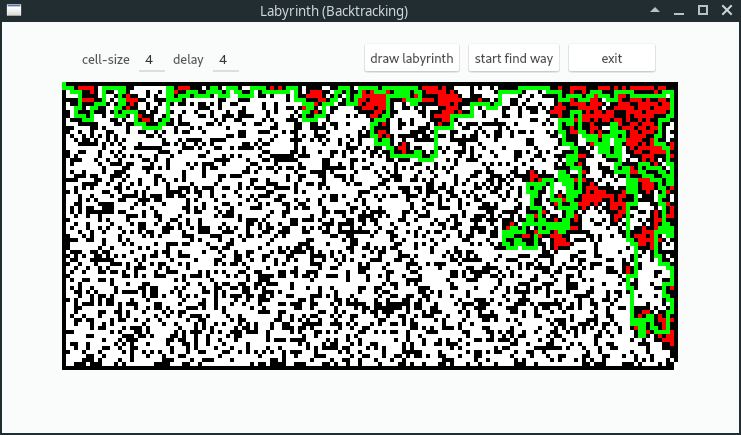
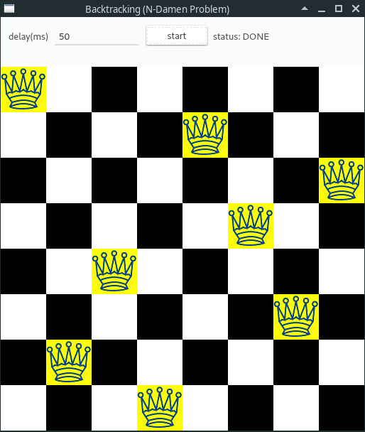
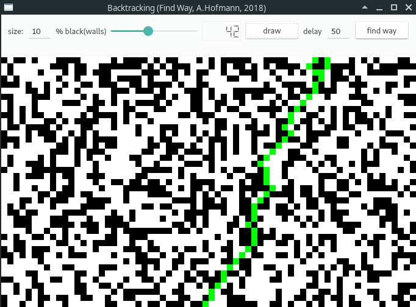

# BACKTRACKING: "try and error" to solve Problems

- <https://de.wikipedia.org/wiki/Backtracking>

## Backtracking: general

Wann:

- Aufgabenstellung besteht aus sehr ähnlichen Teilaufgaben
- Bsp: Finde einen Weg aus einem Labyrinth

Backtracking sammelt

- Teilaufgaben um eine Gesamtlösung zu finden.

Backtracking versucht mittels

- TRY and ERROR die richtigen Teilaufgaben zu wählen.
- Wenn eine Teillaufgabe nicht zu einer endgültigen Lösung führen kann,
wird der letzte Schritt bzw. die letzten Schritte zurückgenommen.
- und es wird stattdessen eine andere Teilaufgabe probiert.

Backtracking garantiert dadurch, dass

- alle in Frage kommenden Lösungswege ausprobiert werden können und
  1. dass eine vorhandene Lösung entweder gefunden wird, oder
  2. dass überhaupt keine Lösung existiert.

Backtracking wird meistens

- rekursiv implementiert.

Backtracking-Algorithmus (allgemein)

~~~cpp
Funktion FindeLösung (Tiefe, Lösung)
  1. wiederhole, solange es noch neue Teilaufgaben gibt:
     a) wähle eine neue Teilaufgabe;
     b) falls Teilaufgabe zur Lösung passt:
            I) erweitere Lösung um Teilaufgabe;
            II) falls Lösung vollständig ist, return true; // FERTIG
                sonst:
                    // Rekursion: nächste TRY-ERROR
                    falls FindeLösung(Tiefe+1, Lösung) return true; // Lösung!
                    sonst mache Wahl rückgängig; // Sackgasse (Backtracking)!
  2. Da es keinen neuen Teil-Lösungsschritt gibt: return false // Keine Lösung!
~~~

## Backtracking: LABYRINTH

~~~cpp
2 dim Array:
   black ... wall
   white ... not visited
   green ... mark as visited way
   red   ... visited without exit

Entry:   top left: x=0, y=0
Exit:    bottom right: x= size-1, y= size-1

Call:    wayout(0,0)

Recursion:
    wayout(x,y)
        // END of recursion
        if wall     return false
        if red      return false     // i was already here
        if green    return false     // i was already here
        if exit     return false     // DONE

        // TRY and ERROR
        // find a way
        mark (x,y) green
        if wayout(oben)      return true
        if wayout(rechts)    return true
        if wayout(unten)     return true
        if wayout(links)     return true

        // ERROR: no way found
        mark (x,y) red
        return false
~~~

## Backtracking: n-QUEEN

~~~cpp
chess-board:
   2 dim Array (int)
     0 ... white
     1 ... black
     2 ... queen

Call: backtrack(0) // row 0

Recursion:
    backtrack(row)
        FOR all cols (col: 0...7)            // all possible cols
            IF inDanger(row,col)             // TRY col
                CONTINUE TRY_NEXT_COL

            // set queen and TRY NEXT ROW
            IF NOT inDanger(row,col)
                SET queen AT chess[row][col]

                // lastROW? -> DONE -> END of RECURSION
                IF row==lastROW
                    return TRUE;
                ELSE
                    // TRY_NEXT_ROW           // TRY row
                    TRY_next_row= backtrack(row+1)

                    IF TRY_next_row==TRUE
                        return TRUE
                    ELSE
                        // error             // ERROR->BACKTRACK
                        // could not find any col for row+1
                        UNSET queen AT chess[row][col]
                        CONTINUE TRY_next_col  // TRY col

        END_FOR

        // ERROR: all cols tested
        return FALSE

~~~

## Backtracking: WAY-TOP-DOWN

-Backtracking: "is there a way top down ?"

~~~cpp
Given is a 'map' with
    1 ... part of a way
    0 ... wall

            top
    row 0:  00100
    row 1:  01100
    row 2:  01010
    row 3:  01001
    row 4:  00001
            bottom

// has way
int lab_way01[5][5]={
    {1,0,1,0,0},
    {1,1,1,0,0},
    {1,1,0,1,0},
    {1,1,0,0,1},
    {1,0,0,0,1}
};

//no way
int lab_noway01[5][5]={
    {0,0,1,0,0},
    {0,1,1,0,0},
    {0,1,0,1,0},
    {0,1,0,0,1},
    {0,0,0,0,0}
};

* hint: way_top_down
bool way_top_down(lab,row,col){
    // recursion termination
    if col<0 ||col>=size
        return false
    if lab[row][col]==0
        return false;

    if lab[row][col]==1
        if row == bottom
            return true // way found: hurrah

        // TRY all options
        if way_top_down(row+1,col-1) return true
        if way_top_down(row+1,col) return true
        if way_top_down(row+1,col+1) return true

        // no way
        return false;
}

* call way_top_down
int main(){
    printf("Test lab_way01 ...\n");
    for(int col=0; col<5; col++){
        if (way_top_down(lab_way01,0, col)){
            printf("There is a way from top to Bottom at col %i\n", col);
        }else{
            printf("There is NO way from top to Bottom at col %i\n", col);
        }
    }

    printf("\nTest lab_noway01 ...\n");
    for(int col=0; col<5; col++){
        if (way_top_down(lab_noway01,0, col)){
            printf("There is a way from top to Bottom at col %i\n", col);
        }else{
            printf("There is NO way from top to Bottom at col %i\n", col);
        }
    }

    // ADD 2 additional TEST-cases

    return 0;
}

* output
Test lab_way01 ...
There is a way from top to Bottom at col 0
There is NO way from top to Bottom at col 1
There is a way from top to Bottom at col 2
There is NO way from top to Bottom at col 3
There is NO way from top to Bottom at col 4

Test lab_noway01 ...
There is NO way from top to Bottom at col 0
There is NO way from top to Bottom at col 1
There is NO way from top to Bottom at col 2
There is NO way from top to Bottom at col 3
There is NO way from top to Bottom at col 4
~~~

## lab: Backtracking

1. 01-way-top-down
2. 02-n-queen-visual

3. 03-labyrinth-visual

4. 04-way-way-top-down-visual

