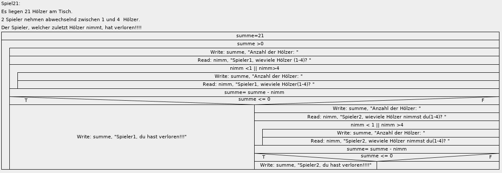

# Aufgaben: Struktogramme und Programme erstellen

1. flaeche
2. tausche
3. maxi
4. summe1
5. summe2
6. pow
7. teiler1
8. teiler2
9. primzahl
10. Spiel21 (struktogramm gegeben)
11. Primfaktorzerlegung
12. Schnelles Potenzieren
13. BMI

---

## 1. Beispiel: flaeche

Lies laenge und breite ein und gib die Fläche aus.

---

## 2. Beispiel: tausche

Lies n und m ein und tausche deren Inhalt. Gib n und m aus.

---

## 3. Beispiel: maxi

Lies 2 Zahlen ein (x, y) und gib die grössere Zahl aus.

---

## 4. Beispiel: summe1

Lies n ein und gib die Summe der Zahlen von 1 bis n aus

---

## 5. Beispiel: summe2

- Lies 2 Zahlen ein (start,ende).
- Berechne die Summe der Zahlen von start bis ende.

~~~
Beispiel:
start: 2 ende: 4
=> summe: 9
~~~

---

## 6. Beispiel: pow

- Lies x und y ein.
- Berechne/gib x hoch y aus.

---

## 7. Beispiel: teiler1

- Lies n ein und gib alle Teiler von n aus.
  - Hinweis: n%2 ….liefert 0 wenn n durch 2 teilbar ist
  - Hinweis: Zum Vergleichen verwende ==

---

## 8. Beispiel: teiler2

- Lies 2 Zahlen ein (start,ende).
- Gib von jeder Zahl zwischen start und ende die Teiler aus.

~~~
Beispiel:
start:3 ende:5
Teiler von 3
	Teiler: 1
	Teiler: 3
Teiler von 4
	Teiler: 1
	Teiler: 2
	Teiler: 4
Teiler von 5
	Teiler: 1
	Teiler: 5
~~~

---

## 9. Beispiel: Primzahl

- Lies eine integer Zahl (n) ein.
- Das Programm soll nur eine positive Zahl größer gleich 2 zulassen.
- Gib aus, ob es sich um eine Primzahl handelt.

Gegeben ist folgender Programmablaufplan für einen Primzahltest:
~~~
Wir testen zunächst, 
- ob die Zahl 2 oder 3 ist => prim
- ob die Testzahl gerade ist => nicht prim
- und  prüfen dann alle ungeraden Zahlen (>2) bis zur Testzahl (n) als mögliche Teiler (t).
  
Damit ließe sich der Primzahltest nun wie folgt beschreiben: 

	* Einlesen der Testzahl n. 
	* Wenn n den Wert 2 oder 3 Ausgabe: „Primzahl“
	* Sonst Weise der Variablen teiler den Wert 3 zu. 
	* Wiederhole bis teiler kleiner der Testzahl n ist: 
	* Ist n durch teiler teilbar? Wenn ja,Ausgabe: "keine Primzahl". Programmende
	* Erhöhe den Wert von teiler um 2. 
	* Ausgabe: n "ist eine Primzahl". 
~~~

Hinweis:  
mit `System.exit(0);` können Sie das Programm beenden.

---

## 10. Beispiel: Spiel21

- Es liegen 21 Hölzer am Tisch. 
- 2 Spieler nehmen abwechselnd zwischen 1 und 4  Hölzer.
- Der Spieler, welcher zuletzt Hölzer nimmt, hat verloren!!!!

- Der Computer verwaltet die Anzahl der Hölzer und fragt abwechselnd die beiden Spieler (Spieler1 und Spieler2) .

---

## 11. Primfaktorzerlegung

- Lies n ein
- Gib die Primfaktoren von n aus.

~~~
Beispiel für eine Ausgabe zu n = 100: 
        100 = 2 * 2 * 5 * 5 . 

Hinweis: Teste die Teiler d = 2, 3, ... 
         wenn d ein Teiler von n ist, dann: n= n / d   (mit n > 1)
         sonst: nimm den nächsten Teiler
~~~

---

## 12. Beispiel: Schnelles Potenzieren

- X hoch y kann man wie folgt sehr schnell berechnen:

~~~
wenn y ungerade:
   ergebnis= ergebnis*x;
   y= y-1;
wenn y gerade:
   x= x*x;
   y= y/2;

Beispiel: x=3 und y=16
   ergebnis= 3 hoch 16
   ergebnis= (3 hoch 2) hoch 8

Beispiel: x=3 und y=17
   ergebnis= 3 hoch 17
   ergebnis= 3 hoch 16 * 3
   ergebnis*3=3 hoch 16
~~~

---

## 13. Beispiel: BMI

Der BMI (Body Mass Index) wird heutzutage verwendet, um zu berechnen ob Normalgewicht oder Übergewicht vorliegt.

- BMI= gewicht_kg / (groesse_m * groesse_m)

Erstellen Sie ein Struktogramm und Programm, das das Gewicht und die Körpergrösse einliest und den BMI ausgibt.

~~~
Anmerkung:
http://www.bleibfit.at/bmi/bmi_rechner.phtml

kritisches Untergewicht: 16,0 und weniger
Untergewicht: 16,0 - 19,9
Normalgewicht: 20,0 - 24,9
Übergewicht: 25,0 - 29,9

Hinweis: 
	zum Vergleichen: && …. ist das logische UND
	zum Vergleichen: || ….. ist das logissche ODER
Bsp:
bmi >= 20.0 && bmi < 25.0

Anmerkung: if...else if...
~~~