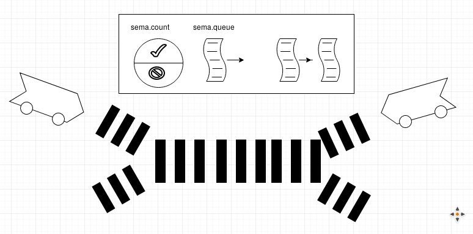

# Lost-Update

- [Wikipedia: Lost-Update](https://de.wikipedia.org/wiki/Verlorenes_Update)

"... Verlorenes Update (auch englisch **lost update**) bezeichnet in der Informatik einen Fehler, der bei mehreren **parallelen Schreibzugriffen** auf eine **gemeinsam** genutzte Information auftreten kann..."

---

## Das Lost-Update Problem

- Mehrere Threads ändern einen gemeinsam genutzten Speicher.
  
- Das Ändern einer Variablen geschieht durch 3 unterbrechbare Operationen:

~~~ bash
1. read
2. increment
3. write
~~~

- Lost-Update passiert, wenn z.B:

~~~ bash
Thread-1: liest
Thread-1: increment

                 Thread-2: liest
                 Thread-2: increment
                 Thread-2: write

Thread-1: write
~~~

---

## Beispiel: OS_04_LostUpdate.java

Das Beispiel zeigt das Lost-Update Problem.

[OS_04_LostUpdate.java](OS_04_LostUpdate.java)

---

## Sperrsychronisation: Kritischer Abschnitt

- see [Wikipedia: Kriticher Abschnitt](https://de.wikipedia.org/wiki/Kritischer_Abschnitt)

"... In der Informatik ist ein **kritischer Abschnitt (engl. ‚critical section’)** eine Menge von Anweisungen, in dem sich zu einer Zeit nur ein einziger Prozess/Thread aufhalten darf. Ähnlich einem Bahnübergang, der nur vom Schienenfahrzeug oder nur von Straßenfahrzeugen befahren werden darf, aber nicht von beiden Fahrzeugarten gleichzeitig..."

---

## Sperrsychronisation: Semaphore

-see [wikipedia: Semaphor](https://de.wikipedia.org/wiki/Semaphor_(Informatik)).

"...Semaphor(e) ist eine **Datenstruktur zur Steuerung eines ausschließenden Zugriffs**. Die allgemeine Bedeutung von Semaphor ist Signalmast (Formsignal bei der Eisenbahn).

Wir betrachten in der Folge sog. binäre Semaphore, d.h. sie besitzen 

1. einen Zähler, der die Werte 0 und 1 annhemen kann und
2. eine queue, um die Prozess-ID (PID) möglicher wartender Prozesse/Threads zu speichern.
3. P-Operation (auch wait() genannt)
4. V-Operation (auch notify() genannt)

~~~ cpp
// 1. DEFINE a SEMAPHORE
typedef struct semaphor {
	int counter;
	Queue* queue; /* Warteschlange */
} Semaphor;

// 2. INIT
void init(Semaphor* sema){
	sema->counter= 1;
	sema->queue= new Queue();
}

// 3. P-OPERATION/ WAIT
void wait(Semaphor* sema){

	if (sema->counter>0) // frei
		sema->counter--;
	else{ // nicht frei

		// aus der READY-Queue des Schedulers nehmen und
		PID= suspend();  
		
		// selbst PID in die Warteschlange einreihen und warten 
		 sema->queue->enqueue(PID);
	}
}

// 4. V-OPERATION/ NOTIFY
void notify(Semaphor* sema){

	if (sema->queue->isEmpty()==false){ 
		// einen Prozess aus der Warteschlange 
		PID= sema->queue->dequeue(); 

		// wieder in die ready-queue des Schedulers eintragen 
		resume(PID); 
	} else // niemand wartet mehr
		sema->counter++;
}
~~~

---

## Sperrsychronisation bei Java: synchronized(){}

Java verwendet das [wikipedia: Mutex-Verfahren](https://de.wikipedia.org/wiki/Mutex)

"...Der Begriff wechselseitiger Ausschluss bzw. **Mutex** (Abk. für englisch mutual exclusion) bezeichnet eine Gruppe von Verfahren, mit denen das Problem des kritischen Abschnitts gelöst wird...."

Ein Mutex kann in Java auf folg. Weise realisiert werden:

~~~ java
// Sync-Objekt !!!!!!!!!!!!!!!!!!!!!!!!!!!!!!!!!!!
private static Object syncLock= new Object();

synchronized (syncLock){

	// critical section

}
~~~

## Aufgabe: OS_05_LostUpdate_Synchronized.java

Das Beispiel zeigt eine Lösung des Lost-Update Problems.

[OS_05_LostUpdate_Synchronized.java](OS_05_LostUpdate_Synchronized.java)

---
