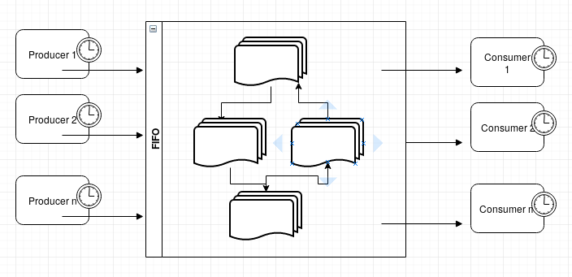
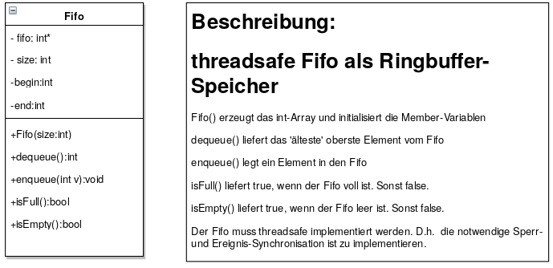
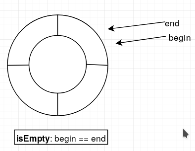
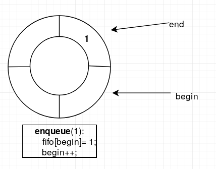
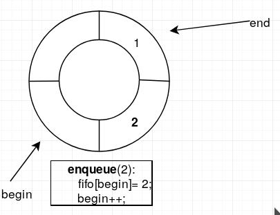
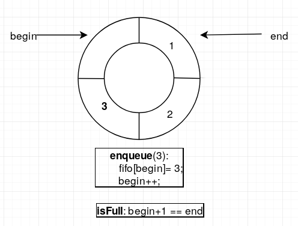
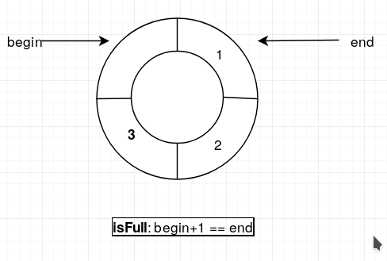
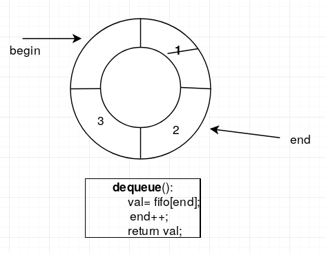
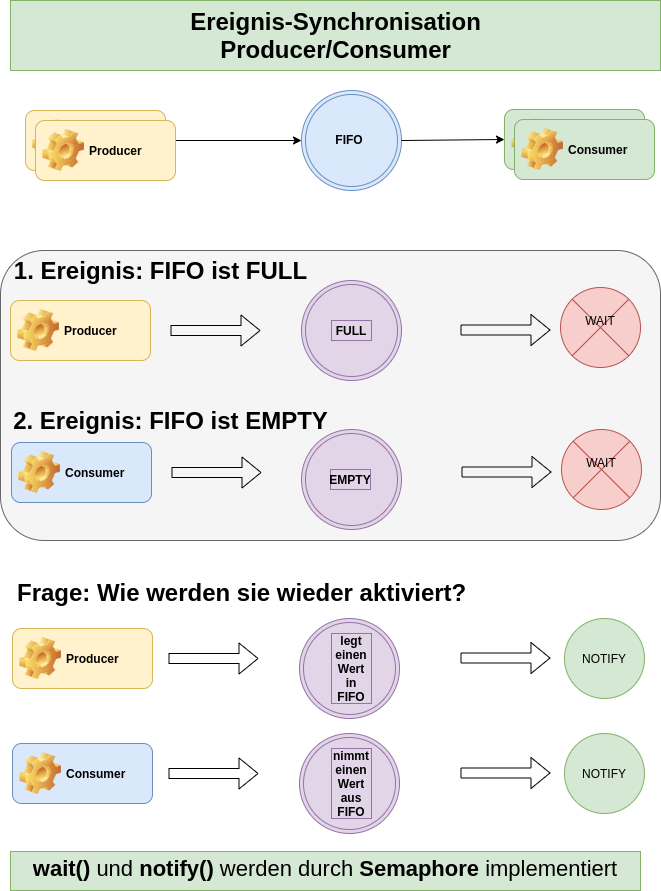
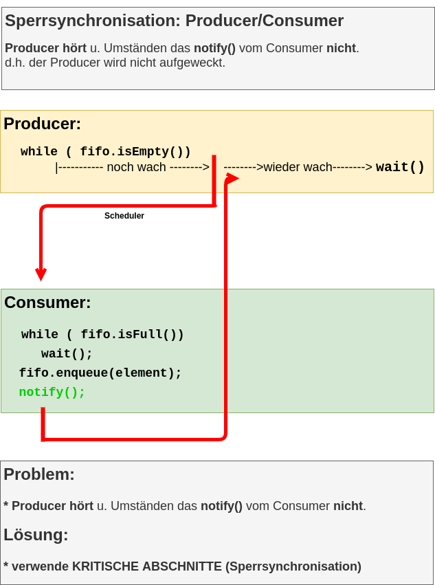

# Producer-Consumer

- see [wikipwdia: Producer-Consumer-Problem](https://en.wikipedia.org/wiki/Producer%E2%80%93consumer_problem)
	
"...In computing, the **producer–consumer problem** is a classic example of a multi-process synchronization problem. The problem describes two processes, the producer and the consumer, who **share a common, fixed-size buffer** used as a queue..." 

- The producer's job is to generate data, put it into the buffer, and start again. 
- At the same time, the consumer is consuming the data (i.e., removing it from the buffer), one piece at a time.
- The problem is to make sure that the producer won't try to add data into the buffer if it's full and that the consumer won't try to remove data from an empty buffer.

---

---

## FIFO - (cyclic queue)

Create class FIFO to store integer values and to throw overfow/underflow exceptions.

Here are some figures to see how class FIFO works.

1. init

2. enqueue(1)

3. enqueue(2)

4. enqueue(3)

4. Buffer is full

5. dequeue(), buffer is not full
   

---

## Aufgabe: class FIFO (noch) nicht threadsafe

- Sie arbeiten im Ordner: 01_FIFO

**Aufgabe:**
- Erstellen Sie die Klasse FIFO (01_FIFO/FIFO.java), sodass das Programm 01_FIFO/Test_FIFO.java funktioniert.

- gegeben: [Test_FIFO.java](01_FIFO/Test_FIFO.java)
- gesucht: [FIFO.java](01_FIFO/FIFO.java)

~~~bash
Hint:
class FullException extends Exception{}
class EmptyException extends Exception{}
~~~

Test with:

~~~bash
cd 01_FIFO
make
make run
make clean
~~~

---

## Ereignis-Synchronisation bei Producer/Consumer-Aufgaben

- Synchronized FIFOs **don't use exceptions** if the buffer is full or empty, because they just have to **wait** for another producer/consumer thread to take/put an item into the FIFO.

- This kind of waiting can be implemented using so called **semaphore-operations: wait() and notify()**.

- A very good example is a concurrent FIFO (cylic buffer).

---

**Hinweis:**

- statt exception verwende wait() und notify()
- statt if, verwende while

statt:

~~~java
public void enqueue(int item) throws FullException {
	if(this.isFull()){
		throw new FullException();
	}
	else{
		queue[begin] = item;
		begin++;
		begin%=size;
	}
}
~~~

verwende die Ereignis-Synchronisation: **wait() bzw. notify()** mit while

~~~java
public void enqueue(int item){
	while(this.isFull()) // !!!!!!!!!!!!!!!
		try {wait();}catch(InterruptedException _ex){};
		
	queue[begin] = item;
	begin++;
	begin%=size;
		
	notify();
}
~~~

Frage: Warum verwendet man while statt if?

---

##  Sperr-Synchronisation bei Producer/Consumer Aufgaben

Nur die Ereignis-Synchronisation zu berücksichtigen ist ein großer Fehler.

Es muss auch folgender Fall bedacht werden:

Annahme:

- Der Producer merkt, dass der FIFO voll ist und **beginnt** die Methode wait() aufzurufen.
- Gerade in diesem Moment (zwischen: "Ich weiss,dass der FIFO voll ist und ich muss jetzt wait() aufrufen), wird der Producer vom Scheduler unterbrochen.
- Nun kann es sein, dass der Scheduler einem Consumer die CPU zuteilt.
- Der Consumer nimmt ein Element aus dem noch vollen FIFO und ruft notify() auf.
- **Dieses notify() soll signalisieren, dass wartende Producer weiter machen können.**
- **Der obige Producer kann aber dieses notify() nicht 'hören', weil er das entsprechende wait() noch nicht ausgeführt hat.**
- Der Producer (vom Scheduler wieder die CPU zugeteilt) führt nun erst das wait() aus, und wartet u.U. 'ewig' auf das notify(), das ja bereits ausgeführt wurde.

Aus diesem Grund braucht man **auch noch die Sperrsynchronisation**, um eventuell 'verloren' gegangene Ereignis-Synchronisations-Aufrufe zu vermeiden.

---

---

Hier nun die endgültig korrekte Version:

~~~java
// !!!!!!!!!!!!
synchronized public void enqueue(int item){
	while(this.isFull()) // !!!!!!!!!!!!!!!
		try {wait();}catch(InterruptedException _ex){};
	
	queue[begin] = item;
	begin++;
	begin%=size;
	
	notify();
}
~~~

---

## Aufgabe: Producer/Consumer (class FIFO threadsafe)

- Sie arbeiten im Ordner: 02_FIFO_threadsafe

Aufgabe:
- Erstellen Sie die Klasse FIFO (02_FIFO_threadsafe/FIFO.java), sodass das Programm 01_FIFO_threadsafe/FIFO.java funktioniert.

- gegeben: [Test_FIFO_threadsafe.java](02_FIFO/Test_FIFO_threadsafe.java)
- gesucht: [FIFO.java](02_FIFO_threadsafe/FIFO.java)

Test with:

~~~bash
cd 01_FIFO_threadsafe
make
make run
make clean
~~~
