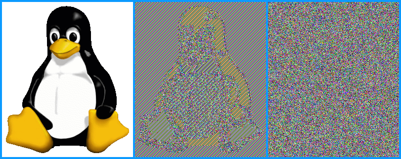

# AES modes ECB and CBC

- AES: (Advanced Encryption Standard (sym.)
- ECB: (Electronic Code Book mode) - middle picture
- CBC: (Cipher Block Chaining) - right picture

## AES: sym. Verschlüsselung mit versch. Betriebsarten

- AES-256 (Advanced Encryption Standard)
  - sym.Verschlüsselung
  - Blockgröße: 128 Bit
  - Schlüsselgröße: 256 Bit

## ECB: Blockchiffre mit Schwächen

- <https://de.wikipedia.org/wiki/Electronic_Code_Book_Mode>
- AES mit ECB (Electronic Code Book)
  - Alle Daten-Blöcke werden unabh. mit dem gleichen Schlüssel verschlüsselt.
  - Problem: identische Klartextblöcke werden zu identischen Chiffre-Blöcken.
  - Dies ist sicherlich ein Nachteil.

### Lab: ECB - Bild verschlüsseln

Das Bild ist größer als die 128 Bit Blocklänge und wird daher auf 128 Blöcke zerlegt. Diese werden jeweils mit AES-256 verschlüsselt. Durch diesen Modus werden alle Blöcke unabh. voneinander verschlüsselt und liefern die gleiche Chiffre.

Wichtig ist dabei das Bildformat. PPM wird gewählt, weil es ein Bitmap-Format ist. 

Vor der Verschlüsselung wird der Header aus der Datei entfernt (sonst wäre das Bild anschließend nicht direkt lesbar). Mittels convert oder Irfan-View kann eine Konvertierung (png->ppm) einfach erfolgen.

~~~bash
convert tux.png tux.ppm

head -n3 tux.ppm > head.ppm

tail -n+4 tux.ppm > tux-body-only.ppm

openssl enc -aes-256-ecb -pass pass:"comein" -in tux-body-only.ppm -out tux-body-only-ecb-enc.ppm

cat tux-body-only-ecb-enc.ppm >> head.ppm

mv head.ppm tux-ecb-enc.ppm

eog tux-ecb-enc.ppm
~~~

Dem verschlüsselten Bild wird anschließend der ursprüngliche Header wieder vorne eingefügt.

 Das Bild kann anschließend mit einem Bildbetrachter wieder geöffnet werden. Es ist klar ersichtlich, dass trotz der zeitgemäßen Verschlüsselung die Figur nach wie vor erkennbar ist. Der Grund ist klar - hintereinander folgende Blöcke mit gleichem Inhalt (Farbe) liefern die gleiche Chiffre. Daher ist dieser ECB-Modus auch zu vermeiden.

## CBC: Bild verschlüsseln

Aus diesem Grund hat man andere Betriebsarten entwickelt, die hier Abhilfe schaffen, indem die Blöcke zueinander in Anhängigkeit gebracht werden.

- AES mit CBC (Cipher Block Chaining)
  - ein Cipher-Block hängt von seinem Vorgänger-Cipher-Block ab.

### Lab: CBC - Bild verschlüsseln

Nun wird das Bild auf die gleiche Art mit Modus CBC verschlüsselt. Hier sieht es wesentlich besser auf - das Bild sieht zufällig durchmischt aus (kein Umriss erkennbar).

~~~bash
convert tux.png tux.ppm

head -n3 tux.ppm > head.ppm

tail -n+4 tux.ppm > tux-body-only.ppm

openssl enc -aes-256-cbc -pass pass:"comein" -in tux-body-only.ppm -out tux-body-only-cbc-enc.ppm

cat tux-body-only-cbc-enc.ppm >> head.ppm

mv head.ppm tux-cbc-enc.ppm

eog tux-cbc-enc.ppm
~~~

## see also

- <https://www.youtube.com/watch?v=k8zJh1tAcok>
- <https://en.wikipedia.org/wiki/File:Tux.jpg>
- <https://en.wikipedia.org/wiki/File:Tux_ecb.jpg>
