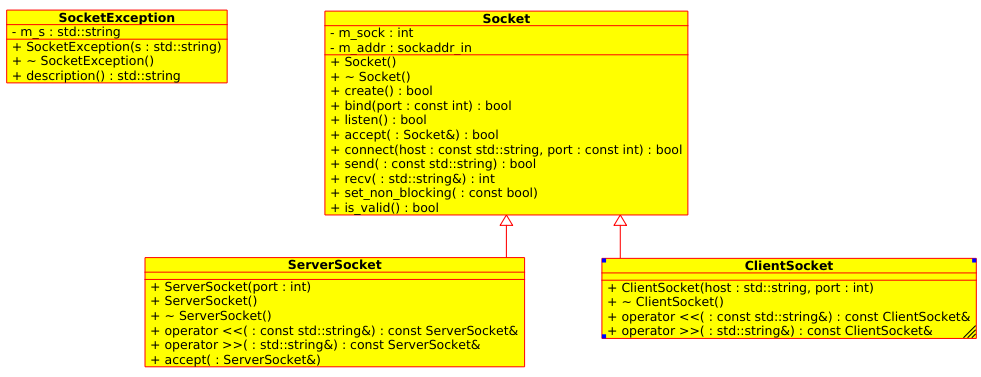

# SOCKET-CPP: Sockets as streams
- source: <http://www.pcs.cnu.edu/~dgame/sockets/socketsC++/sockets.html>

# 1. Study
- and give a short description (members, methods) of  
- <https://gitlab.com/4me/courses/tree/master/WEB-NW-PROG/01-SOCKET/02-ueben/AB-SOCKET-CPP/socket-stream-lib-cpp>  

- class Socket
- class ClientSocket
- class ServerSocket

# 2. Compile and test
1. Compile all Socket classes
    - See and use: CMakeLists.txt, cmake and make
2. test client and server using 2 terminals

- compile
~~~ bash
cd build
cmake ..
make
~~~

- in terminal 1 start the server: 
~~~ bash
./server
~~~

- in terminal 2 start the client: 
~~~ bash
./client
~~~

- in terminal 2 use telnet as client:
~~~ bash
telnet localhost 30000
~~~

- as you can see we are not able to close the connection.
- we have to define a communication protocol.
- see next chapter (server with quit and fork)
