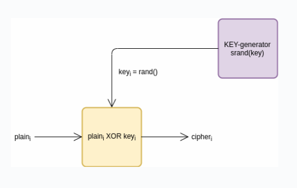

# Lab: Write class CipherStream - A stream with encryption


# 1. study encryption

- give a short description of Stream_cipher <http://en.wikipedia.org/wiki/Stream_cipher>


- description:

# 2. Lab: create  class CipherStream

* We want to create a Stream which encrypts all its input data. **This** stream will be used later for encrypted communication via sockets.

* Lab: **Create** class **CipherStream** so that the following code works.

```cpp
/**
 * @file: test-cipherstream.cpp
 * @author: N.N.
 * @date: dd.mm.yyyy
 */

#include <iostream>
#include <string>
using namespace std;

#include "cipherstream.h"

int main() {
  CipherStream cipherStream(1); // uses Streamcipher with XORSubstitution
                                // key is 1
  string s = "Hallo";
  string plainText;
  string cipherText;

  // 4 encrypt:
  cipherStream << s;            // encrypts and appends the Text to the stream
  cout << cipherStream << endl; // outputs the encrypted Text
                                // in the form:
                                // [ 47,-89,5,31,62 ]
  // or
  cipherStream.encrypt(s);      // encrypts and appends the Text to the stream
  cout << cipherStream << endl; // outputs the encrypted Text
                                // in the form:
                                // [ 47,-89,5,31,62,-73,43,-128,69,-94 ]

  // 2 decrypt:
  cipherStream >> plainText; //
  cout << plainText << endl; // outputs HalloHallo

  // or
  plainText = cipherStream.decrypt();
  cout << plainText << endl; // outputs HalloHallo

  // 2 str()
  cipherText = cipherStream.str();
  cout << cipherText << endl; // outputs encrypted Text (unformatted)
                              // Question: is this usefull ?

  // 2 reset()
  cipherStream.reset(); // deletes the content of the stream and
                        // resets the key generator
  cipherStream << s;
  cout << cipherStream << endl; // outputs the encrypted Text
                                // in the form:
                                // [ 47,-89,5,31,62 ]

  cipherStream << "Hallo";      // encrypts and appends the Text to the stream
  cout << cipherStream << endl; // outputs the encrypted Text
                                // in the form:
                                // [ 47,-89,5,31,62,-73,43,-128,69,-94 ]
                                // 2 setCryptText
  cipherText = cipherStream.getCryptText();
  cout << cipherText << endl; // outputs encrypted text
  cipherStream.reset();       // deletes the content of the stream and
                              // resets the key generator
  cipherStream.setCryptText(cipherText);
  cout << cipherStream << endl;   // outputs the encrypted Text
                                  // in the form:
                                  // [ 47,-89,5,31,62,-73,43,-128,69,-94 ]
  cout << cipherStream.decrypt(); // outputs HalloHallo

  cout << endl << endl;
  cout << "your class CipherStream works correct, if you see \"HalloHallo\" "
          "above"
       << endl
       << endl;

  // ------------------ communication

  // 1. SENDER
  CipherStream out(1);
  string send_plain_msg1 = "<MESSAGE-01>";
  string send_plain_msg2 = "<MESSAGE-02>";
  string send_plain_msg3 = "<MESSAGE-03>";

  cout << "TESTING plain2cipher() and cipher2plain() which are used for  "
          "communication ..." << endl;
          
  cout << "client -> server:" << endl;
  cout << "   " << send_plain_msg1 << endl;
  cout << "   " << send_plain_msg2 << endl;
  cout << "   " << send_plain_msg3 << endl;

  // 2. simulate sending and encryption
  string cipher_msg1;
  string cipher_msg2;
  string cipher_msg3;

  cipher_msg1 = out.plain2cipher(send_plain_msg1);
  cipher_msg2 = out.plain2cipher(send_plain_msg2);
  cipher_msg3 = out.plain2cipher(send_plain_msg3);

  cout << "encrypted and transfered messages: " << endl;
  cout << "   " << cipher_msg1 << endl;
  cout << "   " << cipher_msg2 << endl;
  cout << "   " << cipher_msg3 << endl;

  // 3. RECEIVER
  CipherStream in(1);
  string receive_plain_msg1 = "";
  string receive_plain_msg2 = "";
  string receive_plain_msg3 = "";

  receive_plain_msg1 = in.cipher2plain(cipher_msg1);
  receive_plain_msg2 = in.cipher2plain(cipher_msg2);
  receive_plain_msg3 = in.cipher2plain(cipher_msg3);

  cout << "server -> client:" << endl;
  cout << "   " << receive_plain_msg1 << endl;
  cout << "   " << receive_plain_msg2 << endl;
  cout << "   " << receive_plain_msg3 << endl;

  cout << endl;
  return 0;
}
```
# 3. compile and run
~~~ bash
cd build
cmake ..
make

./test-cipherstream
[ 47,-89,5,31,62 ]

[ 47,-89,5,31,62,-73,43,-128,69,-94 ]

HalloHallo
HalloHallo
/�>�+�E�
[ 47,-89,5,31,62 ]

[ 47,-89,5,31,62,-73,43,-128,69,-94 ]

/�>�+�E�
[ 47,-89,5,31,62,-73,43,-128,69,-94 ]

HalloHallo

your class CipherStream works correct, if you see "HalloHallo" above

TESTING plain2cipher() and cipher2plain() which are used for  communication ...
client -> server:
   <MESSAGE-01>
   <MESSAGE-02>
   <MESSAGE-03>
encrypted and transfered messages: 
�����, �
   ζ�/��6�ճ
   Jk0`ގ�K>�
server -> client:
   <MESSAGE-01>
   <MESSAGE-02>
   <MESSAGE-03>
~~~
