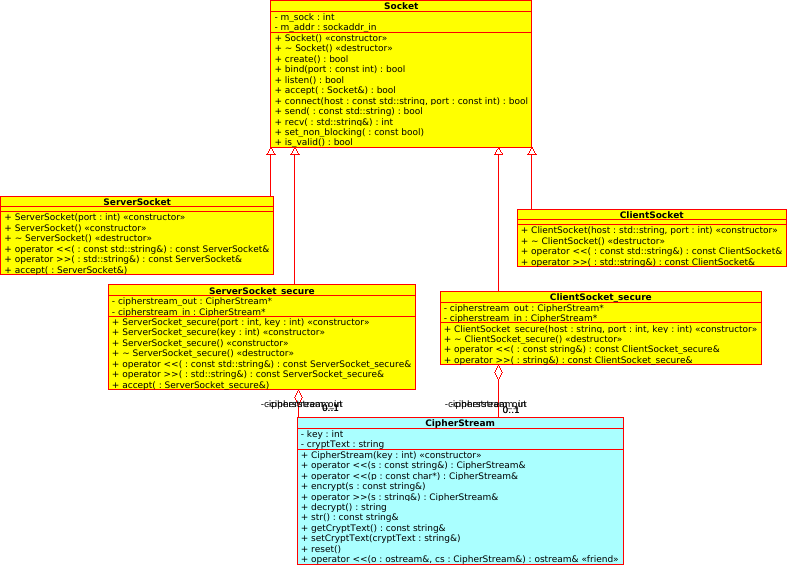

# Lab: Make your socket streams secure

1. create subclasses:
	- ServerSocket_secure
	- Clientsocket_secure
2. use class
	- CipherStream
- Fig. 1: uml class diagram



# Lab 1: ServerSocket_secure, ClientSocket_secure

- These two classes are able to
	- encrypt and
	- transport data.


1. ServerSocket_secure and ClientSocket_secure **use two CipherStream objects**: 
	- out: for sending 
	- in: for receiving.

	``` cpp
		... 
	private:
		CipherStream* in;
		CipherStream* out;
		... 
	```
2. Their constructor gets an additional argument representing the KEY for StreamCipher encryption.
 


# Lab 2: adapt simple_server_main.cpp , simple_client_main.cpp


- simple_client_main.cpp
	- reads user-input
	- sends user-input encrypted
	- receives encrypted response from server
	- outputs response (plain) to user

- simple_server_main.cpp:
	- reads encrypted message from client
	- write message (plain) to console
	- sends message back to client

# Lab 3. wireshark

- Control your programs and encryption using **wireshark**     (filter: tcp.port=4444)
