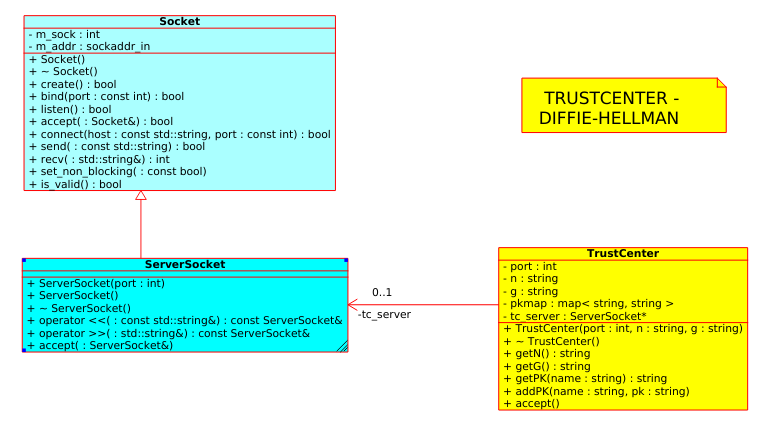
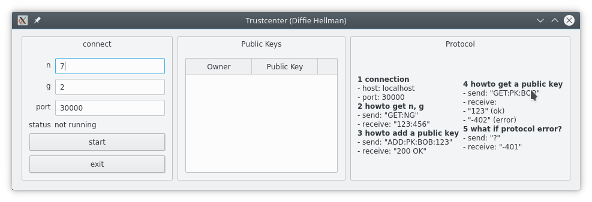

# Diffie-Hellmans Trustcenter

- stores
  - n, g
  - Public Keys

## 1. Study Diffie-Hellman's Trustcenter

- **Study** and **explain**

  - <http://de.wikipedia.org/wiki/Diffie-Hellman-Schl%C3%BCsselaustausch>
  - <http://en.wikipedia.org/wiki/Diffie%E2%80%93Hellman_key_exchange>

- example

~~~bash
Trustcenter:
- n=7 ... modulo
- g=2 ... generator

Alice:
- ASK ... Alice's secret key
- APK ... Alice's public key
Bob:
- BSK ... Bob's secret key
- BPK ... Bob's public key

Alice and Bob:
- KEY ... shared key


Alice:
1. get n,g from trustcenter
2. choose ASK=2
3. calculate APK
    APK= g^ASK mod n
    APK= 2^2 mod 7
    APK= 4
4. send APK to trustcenter
5. get BPK from trustcenter
6. calculate KEY
    KEY= BPK^ASK mod n
    KEY= 1^2 mod 7
    KEY= 1

Bob:
1. get n,g from trustcenter
2. choose BSK=3
3. calculate BPK
    BPK= g^BSK mod n
    BPK= 2^3 mod 7
    BPK= 1
4. send BPK to trustcenter
5. get APK from trustcenter
6. calculate KEY
    KEY= APK^BSK mod n
    KEY= 4^3 mod 7
    KEY= 1

Why has KEY for Alice and Bob the same value?
    1. KEY= APK^BSK mod n
    2. KEY= BPK^ASK mod n

insert 
    APK= g^ASK mod n
    BPK= g^BSK mod n

    1. KEY= (g^ASK)^BSK mod n
    2. KEY= (g^BSK)^ASK mod n

    1. KEY= g^(ASK*BSK) mod n
    2. KEY= g^(BSK*ASK) mod n

    1. KEY= g^(ASK*BSK) mod n
    2. KEY= g^(ASK*BSK) mod n
~~~

## 2. TrustCenter protocol

- Trustcenter offers a service to store public keys for different clients.
- we define a so called trustcenter-protocol to support communication between trustcenter and its clients

~~~ bash
- connection
  - host: localhost
  - port: 30000

- howto get n, g from trustcenter
  - send: "GET:NG"
  - receive: "123:456"

- howto add a public key
  - send: "ADD:PK:BOB:123"
  - receive:    "200 OK"

- howto get a public key
  - send: "GET:PK:BOB"
  - receive:    
    - "123" (ok)
    - "-402" (error)

- what if protocol error?
  - send: "?"
  - receive:    "-401"
  ~~~

## 3. Lab: Trustcenter (command line program)

1. create class **Trustcenter** (trustcenter.h) to store:
    - n,g
    - Public Keys

    - 

2. trustcenter-main.cpp

```cpp
/*
 * @file trustcenter-main.cpp
 * @author N.N.
 * @date dd.mm.yyyy
 * @description The TrustCenter protocol

"GET:NG"
    "123:456"
"ADD:PK:BOB:123"
    "200 OK"
"GET:PK:BOB"
    "123"
    "-402"
"?"
    "-401"
*/

#include "trustcenter.h"

int main ( int argc, char* argv[] ){
    int port=30000;
    string n="5";
    string g="7";

    TrustCenter trustcenter(port,n,g);

    trustcenter.accept();

    return 0;
}
```

3. test your trustcenter using telnet

~~~ bash
telnet localhost 30000
GET:N:G
ADD:PK:BOB:123
GET:PK:BOB
~~~

## 4. Lab: Trustcenter (Qt)
- create a Qt-Widget App (trustcenter-main-qt) for a GUI based implementation.



## 5. Lab: wireshark

~~~ bash
tcp port 30000
bzw.
tcp port 30000 || tcp port 4444

[PSH,ACK] ... tcp soll data an übergeordnete Ebene weiter reichen.
data ........ zeigt die Daten

Menue->Aufzeichnungen->starten/stoppen

siehe: Info from-port <--> to-port

~~~