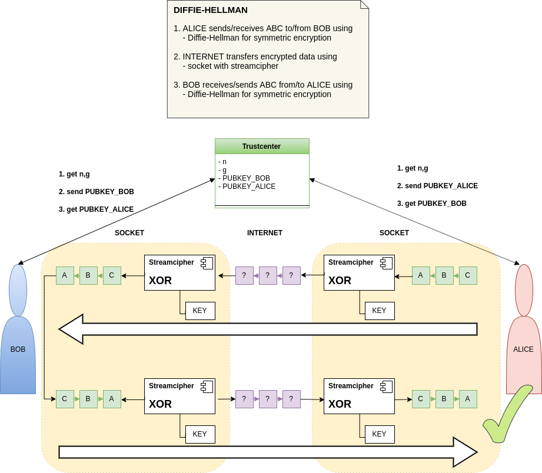

# socket-cpp & DIFFIE-HELLMAN

1. ALICE sends/receives ABC to/from BOB using
    - Diffie-Hellman for symmetric encryption

2. INTERNET transfers encrypted data using
    - socket with streamcipher

3. BOB receives/sends ABC from/to ALICE using
    - Diffie-Hellman for symmetric encryption

- see: <https://gitlab.com/4me/courses/tree/master/WEB-NW-PROG/01-SOCKET/02-ueben/AB-SOCKET-CPP>

- git-commands:

~~~
--------------------------------------------------------------------------------
cd web-nw-prog
git clone https://gitlab.com/htl_fsst/web-nw-prog/socket-cpp.git
cd socket-cpp
git checkout -b NAME
git add .....
git commit -m"done"
git push -set-upstream origin NAME
~~~
