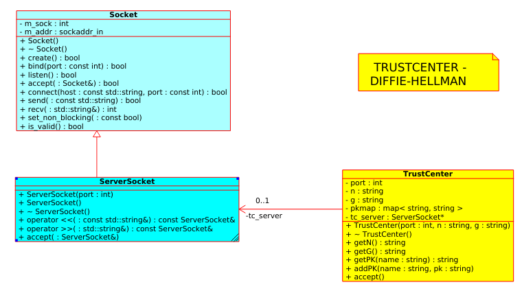
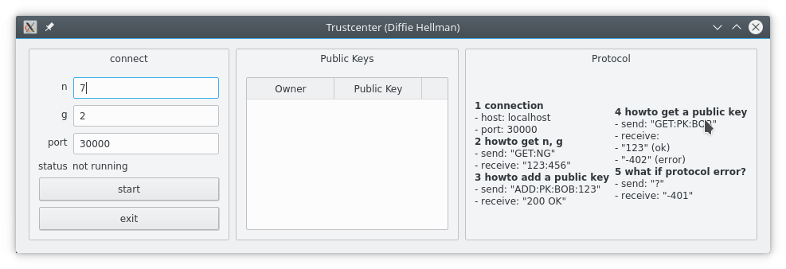

# Diffie-Hellmans Trustcenter , Alice and Bob
---------------------------------------------

- File: 05-streams-diffie-hellman-mit-Qt.md

## 1. Aufgabe: Study Diffie-Hellman's Trustcenter
-------------------------------------------------

**Study** and **explain**

```
* <http://de.wikipedia.org/wiki/Diffie-Hellman-Schl%C3%BCsselaustausch>
* <http://en.wikipedia.org/wiki/Diffie%E2%80%93Hellman_key_exchange>
```


## 2. Aufgabe: Trustcenter (Qt program)
------------------------------------------------

Create a Qt-Programm **Trustcenter** and it should act like a TrustCenter that can be called by every program using

```
* hostname
* port
* and the TrustCenter protocol
```





### 2.1. TrustCenter protocol
----------------------------------

- connection

  - host: localhost
  - port: 30000

- howto get n, g from trustcenter

  - send: "GET:NG"
  - receive: "123:456"

- howto add a public key

  - send: "ADD:PK:BOB:123"
  - receive:    "200 OK"

- howto get a public key

  - send: "GET:PK:BOB"
  - receive:    

    - "123" (ok)
    - "-402" (error)

- what if protocol error?

  - send: "?"
  - receive:    "-401"


### 2.2. Qt-trustcenter program (tips)
----------------------------------------

Topic:  
* QTableView
* Threads
* Signale, Slots
* Socket-Klassen (windows and POSIX-Syteme)


### widget.h (Auszug)
---------------------------------------

```cpp

...

class Widget : public QWidget{
	Q_OBJECT

public:
	explicit Widget(QWidget *parent = 0);
	~Widget();

public slots:
	// !!!!!!!!!!!!!!!!!
	// gesendet vom ServerThread
	void on_show_PK(const QString& name, const QString& pk);  
	
private slots:
	void on_pushButton_start_clicked();
	void on_pushButton_exit_clicked();

private:
	Ui::Widget *ui;

	// Model for TableView
	QStandardItemModel* model;
};

...

```

### widget.cpp (Auszug)
------------------------------------------------
```cpp

...

#include "serverthread.h"
#include <QDebug>

Widget::Widget(QWidget *parent) :
	QWidget(parent),
	ui(new Ui::Widget)
{
	ui->setupUi(this);

// UI: ------------------------------------------------
	model= new QStandardItemModel(0,2); // 2 Spalten

	model->setHorizontalHeaderItem(0, new QStandardItem(QString("Owner")));
	model->setHorizontalHeaderItem(1, new QStandardItem(QString("Public Key")));

	ui->tableViewPUBKEYs->setModel(model);
}


void Widget::on_pushButton_start_clicked()
{
	int port;
	string n,g;

	port= ui->lineEditPort->text().toInt();
	n= ui->lineEditN->text().toStdString();
	g= ui->lineEditG->text().toStdString();

	// TC-Thread ---------------------------------------------------------
	ServerThread* serverThread = new ServerThread(port,n,g,this);

	// TC-Thread: Signal ->  UI:Slot 
	connect(	serverThread, 	SIGNAL(show_PK(const QString&,const QString&)), 
				this, 			SLOT(on_show_PK(const QString&, const QString&)));
	
	
	serverThread->start();

	ui->labelStatus->setText("<b>running</b>");
}


// Vom ServerThread gesendet
void Widget::on_show_PK(const QString &name, const QString &pk){

	// eintragen
	int row= model->rowCount();
	
	model->setItem(row,0,new QStandardItem(name));
	model->setItem(row,1,new QStandardItem(pk));
}
...

```


### serverthread.h (Auszug)
------------------------------------------------------------

```cpp

...

#include <QThread>
#include "socket/ServerSocket.h"
#include "socket/SocketException.h"

#include "widget.h"

#include <sstream>
#include <iostream>
#include <string>
#include <map>
using namespace std;

class ServerThread : public QThread {
	Q_OBJECT

	friend class Widget;

private:
	int port;
	string n,g;
	
	map<string,string> pkmap;

	ServerSocket* tc_server;

	Widget* widget;
	// ------------------------------------

	string getN() { return n;}
	string getG() { return g;}

	string getPK(string name) {

		// TODO: cpp map find
		
	}

	void addPK(string name, string pk){
		// TODO: cpp map operator[]
		
		//TC-Thread: Signal to UI
		// !!!!!!!!!!!!!!!!!!!!!!!
		emit show_PK(QString(name.c_str()), QString(pk.c_str()));	

	}


public:
	ServerThread(int port, string n, string g, Widget* widget)
		: port(port), n(n),g(g), widget(widget){

		// !!!!!!!!!!!!!!!!!!!!!!!
		// create ServerSocket on port
		try{
			tc_server= new ServerSocket(port);
		}catch ( SocketException& e ){
			std::cout << "Exception was caught:" << e.description() << "\nExiting.\n";
		}
	}

	~ServerThread(){
		delete tc_server;
	}

// SIGNALs to Trustcenter
signals:
	void show_PK(const QString& name, const QString& pk);
	
	
// TrustCenter-Thread: RUN (accept-read-implement
// = accept
public:	
	void run() override {

		cout << "TrustCenter running on port " << port << "...."<< endl;

		while ( true ){
			ServerSocket new_sock;
			tc_server->accept ( new_sock );

			try{
				string cmd;

				// READ from client
				new_sock >> cmd;

				/*
					"GET:NG"
						"123:456"

					"ADD:PK:BOB:123"
						"200 OK"

					"GET:PK:BOB"
						"123"
						"-402"

					"?"
						"-401"

				*/
				cout <<"SERVER got <" << cmd<< ">" << endl;
				unsigned found = cmd.find_last_of("\r\n");
				cmd= cmd.substr(0, found-1);
				cout <<"SERVER got <" << cmd<< ">" << endl;

				stringstream ss(cmd);
				string part;

				std::getline(ss, part, ':');

				if (part== "ADD"){ 
					string name;
					string pk;

					//TODO : "ADD:PK:BOB:123"


					
					
				}else if (part=="GET"){
					std::getline(ss, part, ':'); //PK or NG
					if (part=="NG"){

						// TODO: GET:NG
						
					}else if (part=="PK"){

						// TODO: GET:PK:BOB
					

					}else{
						new_sock << "-401";
					}
				}else{
					new_sock << "-401";
				}

				cout <<"Server closing connection..." << std::endl;

			}catch ( SocketException& e ){
				std::cout << "Exception was caught:" << e.description() << "\nExiting.\n";
			}

		} // while
	}

};

...

```

Dont forget (on windows and Qt) to put the following lines into your trustcenter.pro file.

```
LIBS += C:/Qt/Qt5.8.0/Tools/mingw530_32/i686-w64-mingw32/lib/libws2_32.a
```


## 3. Aufgabe: Diffie-Hellman: TrustCenter, Alice and Bob
---------------------------------------------------------

**Topic**  
* programs:
	* TRUSTCENTER on port 30000
	* ALICE (acts like a client)
	* BOB (acts like a server on port 4444) 
* instead of key-exchange use Diffie-Hellman
* Alice and Bob use encrypted communication (symmetric cipher: streamcipher.h)
* Alice,Bob use plain communication with trustcenter
* test with wireshark


**Alice uses classes:**  
* Socket, SocketException
* ClientSocket
* ClientSocket_secure
* DH (see below)
* alice.cpp (see below)

**Bob uses classes:**  
* Socket, SocketException
* ClientSocket 
* ServerSocket_secure
* DH (see below)
* bob.cpp (see below)

**TrustCenter uses classes:**  
* Socket, SocketException
* ServerSocket
* ServerThread
* Widget


### alice.cpp and bob.cpp  
------------------------------

See how Alice (same as Bob) gets the key for the streamcipher encryption:  
1. receive: n,g from trustcenter at port 30000
2. choose: int secretKeyAlice; //(SKA)
3. calculate: int publicKeyAlice= pow(g, SKA) % n; // PKA
4. send: PKA to trustcenter
5. wait until Bobs public key (PKB) is available from trustcenter
6. calculate: int key= ????????
7. do the encrypted communication.


### class DH (used by alice and bob)
----------------------------------------
```cpp

#include "ServerSocket_secure.h"
#include "SocketException.h"

#include <string>
#include <iostream>

#include <cstdlib>
#include <cstdio>
#include <cmath>


#include <unistd.h>
#include <sys/types.h>
#include <sys/wait.h>

// consts
const int TRUSTCENTER_PORT=30000;
const char* TRUSTCENTER_HOST= "localhost";
const int BOB_PORT=4444;
const char* BOB_HOST= "localhost";


#include "ClientSocket.h"
class DH {
	private:
		int trustcenter_port;
		string trustcenter_hostname;

		string myName;
		string partnerName;
		int n,g;
		int myPubKey;
		int partnerPubKey;
		int secretNumber;
		int symKEY;

		void getNG();
		void calcPubKey();
		void sendPubKey();
		void receivePartnerPubKey();
		void calcSymKEY();
	public:
		DH(string hostname, int port, string myName, string partnerName){
			trustcenter_hostname= hostname;
			trustcenter_port= port;
			this->myName=myName;
			this->partnerName=partnerName;


			getNG();
			calcPubKey();
			sendPubKey();
			receivePartnerPubKey();
			calcSymKEY();
		}

		int getSymKEY()const{
			return symKEY;
		}

		~DH(){};
};
/*
void DH::getNG(){}
void DH::calcPubKey(){}
void DH::sendPubKey(){}
void DH::receivePartnerPubKey(){}
void DH::calcSymKEY(){}
*/

void DH::getNG(){
		// 1. RECEIVE g,n from trustcenter
cout << "... receiving n,g from trustcenter (GET:NG)" << endl;
	string data, part;

	ClientSocket trustcenter(trustcenter_hostname, trustcenter_port);

	trustcenter << "GET:NG";
	trustcenter >> data;

	stringstream ss(data);
	// N
	std::getline(ss, part, ':');
	sscanf(part.c_str(),"%i", &n);
	// G
	std::getline(ss, part, ':');
	sscanf(part.c_str(),"%i", &g);
	
cout << "... got n= "<<n<<", g="<<g <<endl;
}


void DH::calcPubKey(){
	
	secretNumber= rand()%5;	
cout << "... choosing secret number: = " << secretNumber << endl;
cout << "... calculating Public Key: PK= (int) pow("<<g<<","<< secretNumber <<") % " << n << endl;

	myPubKey= (int) pow(g,secretNumber) % n; 

cout << "... Public key= " << myPubKey << endl;
}


void DH::sendPubKey(){
cout << "... sending Public Key to TC: = " << myPubKey << endl;
	ClientSocket trustcenter(trustcenter_hostname, trustcenter_port);

	ostringstream os;
	os << "ADD:PK:" << myName <<":" << myPubKey;
	trustcenter << os.str();

cout << "... ADD:PK:" << myName << ":" << myPubKey<< endl;
}


void DH::receivePartnerPubKey(){
cout << "... receiving/waiting for partner public key" << endl;

	partnerPubKey=-1;
	do{
		usleep(1000*1000*5); // 5sec

		string data;
		ostringstream os;
		os << "GET:PK:" << partnerName;

		ClientSocket trustcenter(trustcenter_hostname, trustcenter_port);
		trustcenter << os.str();
		trustcenter >> data;

cout << "... got from trustcenter: " << data << endl;
	
		if (data != "-401" && data != "-402"){
			sscanf(data.c_str(), "%i", &partnerPubKey);
		}

	} while (partnerPubKey == -1);
	
cout << "... got from trustcenter Partner's Public Key = " << partnerPubKey << endl;

}


void DH::calcSymKEY(){
	symKEY= (int) pow(partnerPubKey, secretNumber) % n;
cout << "... calculating symKEY = (int) pow(";
cout << partnerPubKey <<"," << secretNumber <<")%" << n << "= "<< symKEY <<endl;
}

```

### alice.cpp (Auszug)
-----------------------------
```cpp

/** alice.cpp
* ahofmann, 2015
*/

#include "ClientSocket_secure.h"
#include "SocketException.h"

#include <iostream>
#include <cstdlib>
using namespace std;

#include "DH.h"


int main ( int argc, char* argv[] ){
	cout << endl << "ALICE starting ....";
	cout << endl << "enter \"go\" to start ...";
	string in;
	cin >> in;

														// me     //partner
	DH diffie_hellman(TRUSTCENTER_HOST, TRUSTCENTER_PORT,"ALICE", "BOB");

	int symKEY= diffie_hellman.getSymKEY();


	ClientSocket_secure client_socket(BOB_HOST, BOB_PORT, symKEY);
	string reply;

	try{
		string data="Test message.";

cout << "ALICE: sending <" << data << ">" << endl;
		client_socket << data;
		client_socket >> reply;
cout << "ALICE: received: <" << reply << ">" << endl;
	}catch ( SocketException& e) {
		cerr << "error: SocketException ..." << endl;
		exit(1);
	}

	cout << endl << "ALICE finished ....";
	cout << endl << "enter \"stop\" to finish ...";
	cin >> in;

	return 0;
}


```

### bob.cpp 
--------------------------
TODO implement bob.cpp (see alice.cpp) 
