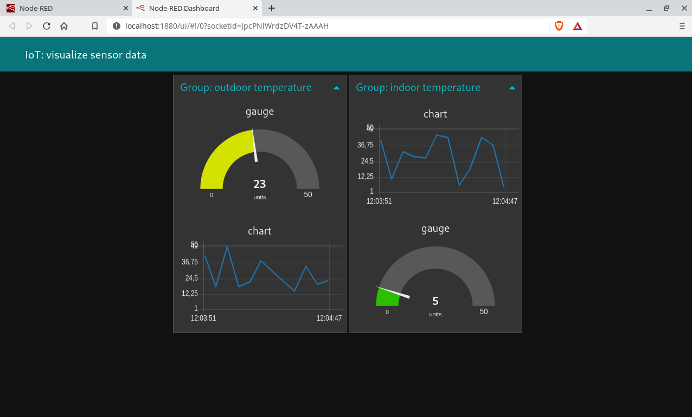
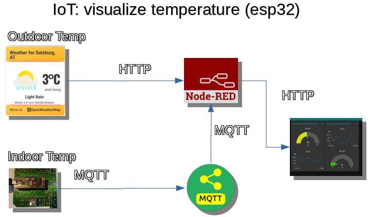
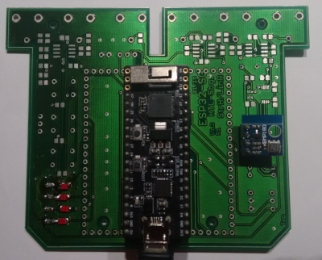
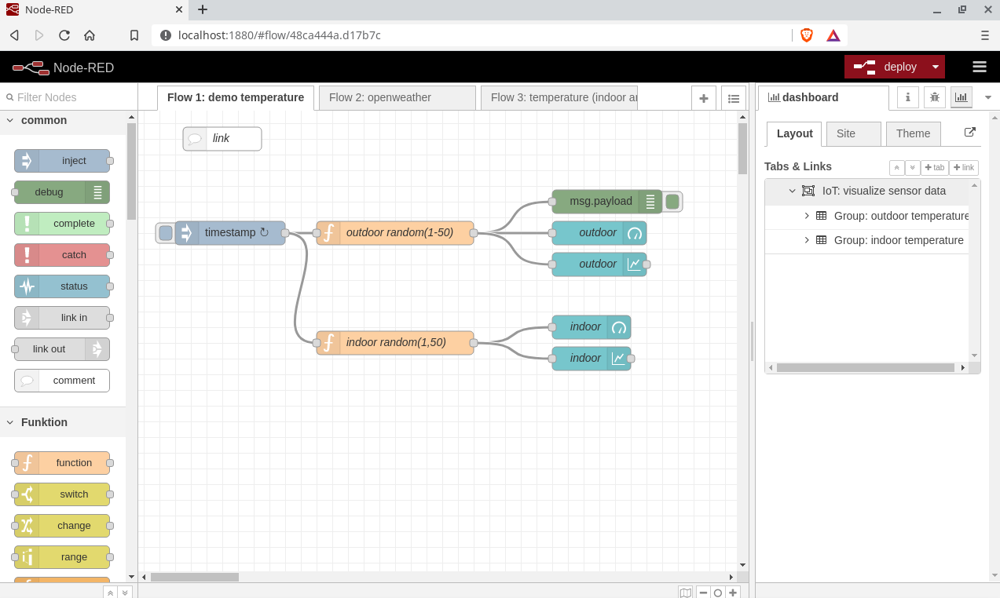
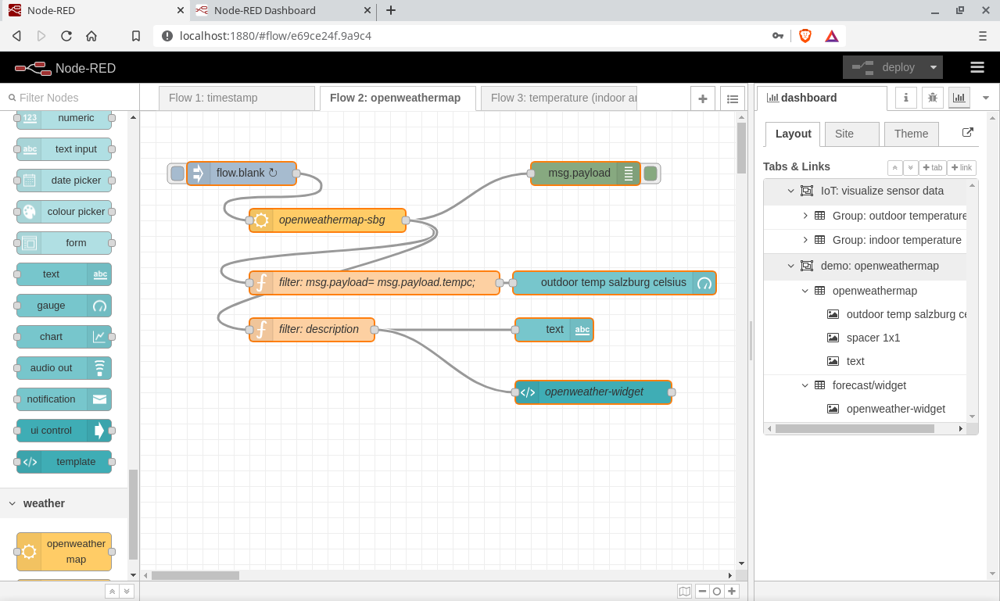
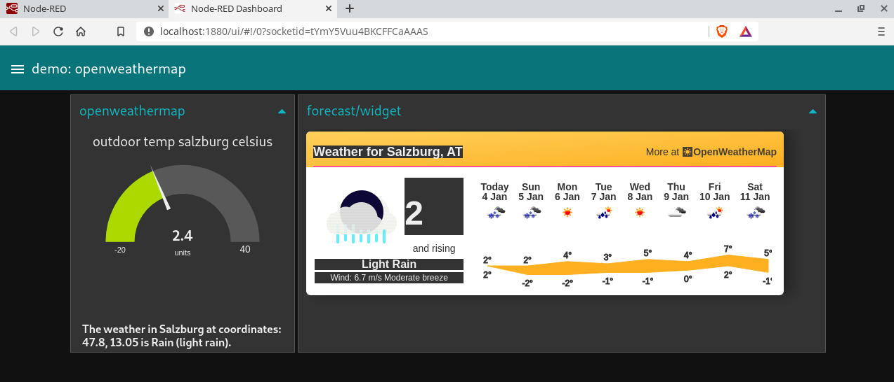
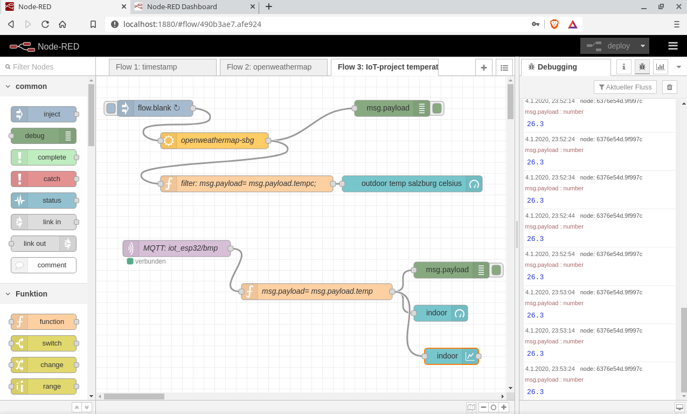
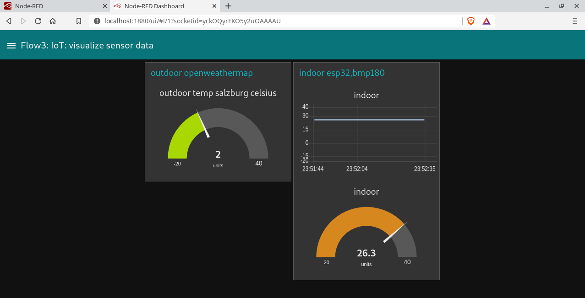

# IoT: visualize sensor data

* Visualize indoor and outdoor temperature
  + indoor (esp32, bmp180)
  + outdoor (<https://openweathermap.org/>)

* using
  + esp32 pico kit (espressif)
  + bmp180
  + mqtt (<http://test.mosquitto.org>)
  + node red
  + node red dashboard
  + vscode with platformIO IDE

## example: htl-esp32

## example: node-red

## example: platformio.ini

~~~ 
[env:pico32]
platform = espressif32
board = pico32
framework = arduino
monitor_speed= 115200
build_flags = -std=c++11
lib_deps= 
  Sodaq_BMP085     # bmp180
  AsyncMqttClient  # mqtt
  ArduinoJson      # json
~~~

# demo: 01-hello

~~~cpp
#include <Arduino.h>

int pin25 = 0; 
int pin26 = 0; 

void setup() {
  pinMode(pin25, OUTPUT); 
  pinMode(pin26, OUTPUT); 
  Serial.begin(115200); 
  Serial.println("setup"); 
}

void loop() {
  Serial.println("loop"); 
  digitalWrite(pin25, HIGH); // Schaltet die LED ein
  digitalWrite(pin26, HIGH); // Schaltet die LED ein
  delay(1000); // 1s warten
  digitalWrite(pin25, LOW); // Schaltet die LED ein
  digitalWrite(pin26, LOW); // Schaltet die LED ein
  delay(1000); 
}
~~~

# demo: 02-bmp

~~~cpp
#include <Wire.h>
#include <Sodaq_BMP085.h>

/*************************************************** 
  This is an example for the BMP085 Barometric Pressure & Temp Sensor

  Designed specifically to work with the Adafruit BMP085 Breakout 
  ----> https://www.adafruit.com/products/391

  These displays use I2C to communicate, 2 pins are required to  
  interface
  Adafruit invests time and resources providing this open source code, 
  please support Adafruit and open-source hardware by purchasing 
  products from Adafruit!

  Written by Limor Fried/Ladyada for Adafruit Industries.
  BSD license, all text above must be included in any redistribution
 ****************************************************/

// Connect VCC of the BMP085 sensor to 3.3V (NOT 5.0V!)
// Connect GND to Ground
// Connect SCL to i2c clock - on '168/'328 Arduino Uno/Duemilanove/etc thats Analog 5
// Connect SDA to i2c data - on '168/'328 Arduino Uno/Duemilanove/etc thats Analog 4
// EOC is not used, it signifies an end of conversion
// XCLR is a reset pin, also not used here

Sodaq_BMP085 bmp; 
  
void setup() {
  Serial.begin(9600); 
  bmp.begin(); 
}
  
void loop() {

    Serial.print("Temperature = ");
    Serial.print(bmp.readTemperature());
    Serial.println(" *C");
    
    Serial.print("Pressure = ");
    Serial.print(bmp.readPressure());
    Serial.println(" Pa");
    
    // Calculate altitude assuming 'standard' barometric
    // pressure of 1013.25 millibar = 101325 Pascal
    Serial.print("Altitude = ");
    Serial.print(bmp.readAltitude());
    Serial.println(" meters");

  // you can get a more precise measurement of altitude
  // if you know the current sea level pressure which will
  // vary with weather and such. If it is 1015 millibars
  // that is equal to 101500 Pascals.

    Serial.print("Real altitude = ");
    //Serial.print(bmp.readAltitude(101500));
    Serial.print(bmp.readAltitude(104120));  // siehe zamg
    Serial.println(" meters");
    
    Serial.println();
    delay(10000); // 10 sec

}

~~~

# demo: 03-wifi

~~~cpp
// GET MAC Address

#include "WiFi.h"

#define WIFI_SSID "FORTI_INTERNET"
#define WIFI_PASSWORD "PASSWORD"

void setup() {
  Serial.begin(115200); 
  
  WiFi.mode(WIFI_MODE_STA); 
  WiFi.begin(WIFI_SSID, WIFI_PASSWORD); 
  while (WiFi.status() != WL_CONNECTED) {

    delay(500);
    Serial.println("Connecting to WiFi..");

  }

  Serial.println("Connected to WiFi.."); 
  Serial.println("Mac: " + WiFi.macAddress()); 
  Serial.println("IP:  " + WiFi.localIP().toString()); 
}

void loop() {}
~~~

# demo: 03-mqtt

~~~cpp
/*
This example uses FreeRTOS softwaretimers as there is no built-in Ticker library
*/

#include <WiFi.h>
extern "C" {
#include "freertos/FreeRTOS.h"
#include "freertos/timers.h"
}
#include <AsyncMqttClient.h>

#define WIFI_SSID "FORTI_INTERNET"
#define WIFI_PASSWORD "PASSWORD"

//#define MQTT_HOST IPAddress(192, 168, 1, 10)
#define MQTT_HOST "test.mosquitto.org"
#define MQTT_PORT 1883

AsyncMqttClient mqttClient; 
TimerHandle_t mqttReconnectTimer; 
TimerHandle_t wifiReconnectTimer; 

void connectToWifi() {
  Serial.println("Connecting to Wi-Fi... "); 
  WiFi.begin(WIFI_SSID, WIFI_PASSWORD); 
}

void connectToMqtt() {
  Serial.println("Connecting to MQTT... "); 

  // mqttClient.setServer(MQTT_HOST, MQTT_PORT); 

  mqttClient.connect(); 
}

void WiFiEvent(WiFiEvent_t event) {
  Serial.printf("[WiFi-event] event: %d\n", event); 
  switch (event) {
  case SYSTEM_EVENT_STA_GOT_IP:

    Serial.println("WiFi connected");
    Serial.println("IP address: ");
    Serial.println(WiFi.localIP());
    connectToMqtt();
    break;

  case SYSTEM_EVENT_STA_DISCONNECTED:

    Serial.println("WiFi lost connection");
    xTimerStop(
        mqttReconnectTimer,
        0); // ensure we don't reconnect to MQTT while reconnecting to Wi-Fi
    xTimerStart(wifiReconnectTimer, 0);
    break;

  }
}

void onMqttConnect(bool sessionPresent) {
  Serial.println("Connected to MQTT."); 
  Serial.print("Session present: "); 
  Serial.println(sessionPresent); 

  uint16_t packetIdSub = mqttClient.subscribe("test/lol", 2); 
  Serial.print("Subscribing at QoS 2, packetId: "); 
  Serial.println(packetIdSub); 

  mqttClient.publish("test/lol", 0, true, "test 1000000"); 
  Serial.println("Publishing at QoS 0"); 

  uint16_t packetIdPub1 = mqttClient.publish("test/lol", 1, true, "test 2"); 
  Serial.print("Publishing at QoS 1, packetId: "); 
  Serial.println(packetIdPub1); 

  uint16_t packetIdPub2 = mqttClient.publish("test/lol", 2, true, "test 3"); 
  Serial.print("Publishing at QoS 2, packetId: "); 
  Serial.println(packetIdPub2); 
}

void onMqttDisconnect(AsyncMqttClientDisconnectReason reason) {
  Serial.println("Disconnected from MQTT."); 

  if (WiFi.isConnected()) {

    xTimerStart(mqttReconnectTimer, 0);

  }
}

void onMqttSubscribe(uint16_t packetId, uint8_t qos) {
  Serial.println("Subscribe acknowledged."); 
  Serial.print("  packetId: "); 
  Serial.println(packetId); 
  Serial.print("  qos: "); 
  Serial.println(qos); 
}

void onMqttUnsubscribe(uint16_t packetId) {
  Serial.println("Unsubscribe acknowledged."); 
  Serial.print("  packetId: "); 
  Serial.println(packetId); 
}

void onMqttMessage(char *topic, char *payload, 

                   AsyncMqttClientMessageProperties properties, size_t len,
                   size_t index, size_t total) {

  Serial.println("Publish received."); 
  Serial.print("  topic: "); 
  Serial.println(topic); 
  Serial.print("  qos: "); 
  Serial.println(properties.qos); 
  Serial.print("  dup: "); 
  Serial.println(properties.dup); 
  Serial.print("  retain: "); 
  Serial.println(properties.retain); 
  Serial.print("  len: "); 
  Serial.println(len); 
  Serial.print("  index: "); 
  Serial.println(index); 
  Serial.print("  total: "); 
  Serial.println(total); 
}

void onMqttPublish(uint16_t packetId) {
  Serial.println("Publish acknowledged."); 
  Serial.print("  packetId: "); 
  Serial.println(packetId); 
}

void setup() {
  Serial.begin(115200); 
  Serial.println(); 
  Serial.println(); 

  // one shot in 2sec
  mqttReconnectTimer =

      xTimerCreate("mqttTimer", pdMS_TO_TICKS(2000), pdFALSE, (void *)0,
                   reinterpret_cast<TimerCallbackFunction_t>(connectToMqtt));

  wifiReconnectTimer =

      xTimerCreate("wifiTimer", pdMS_TO_TICKS(2000), pdFALSE, (void *)0,
                   reinterpret_cast<TimerCallbackFunction_t>(connectToWifi));

  WiFi.onEvent(WiFiEvent); 

  mqttClient.onConnect(onMqttConnect); 
  mqttClient.onDisconnect(onMqttDisconnect); 
  mqttClient.onSubscribe(onMqttSubscribe); 
  mqttClient.onUnsubscribe(onMqttUnsubscribe); 
  mqttClient.onMessage(onMqttMessage); 
  mqttClient.onPublish(onMqttPublish); 
  mqttClient.setServer(MQTT_HOST, MQTT_PORT); 

  connectToWifi(); 
}

void loop() {}
~~~

# demo: 03-mqtt-pubsubclient

~~~cpp
todo
~~~

# demo: 04-json

~~~cpp
// ArduinoJson - arduinojson.org
// Copyright Benoit Blanchon 2014-2019
// MIT License
//
// This example shows how to deserialize a JSON document with ArduinoJson.
//
// https://arduinojson.org/v6/example/parser/

#include <ArduinoJson.h>

const char* sensor ; 
  long json_time ; 
  double latitude; 
  double longitude; 

void setup() {
  // Initialize serial port
  Serial.begin(115200); 
  //while (! Serial) continue; 

Serial.println("hhhhhhhhhhhhhhh"); 
  
  // Allocate the JSON document
  //
  // Inside the brackets, 200 is the capacity of the memory pool in bytes.
  // Don't forget to change this value to match your JSON document.
  // Use arduinojson.org/v6/assistant to compute the capacity.
  StaticJsonDocument<200> doc; 

  // StaticJsonDocument<N> allocates memory on the stack, it can be
  // replaced by DynamicJsonDocument which allocates in the heap.
  //
  // DynamicJsonDocument doc(200); 

  // JSON input string.
  //
  // Using a char[], as shown here, enables the "zero-copy" mode. This mode uses
  // the minimal amount of memory because the JsonDocument stores pointers to
  // the input buffer.
  // If you use another type of input, ArduinoJson must copy the strings from
  // the input to the JsonDocument, so you need to increase the capacity of the
  // JsonDocument.
  char json[] =

      "{\"sensor\":\"gps\",\"time\":1351824120,\"data\":[48.756080,2.302038]}";

  // Deserialize the JSON document
  DeserializationError error = deserializeJson(doc, json); 

  // Test if parsing succeeds.
  if (error) {

    Serial.print(F("deserializeJson() failed: "));
    Serial.println(error.c_str());
    return;

  }

  // Fetch values.
  //
  // Most of the time, you can rely on the implicit casts.
  // In other case, you can do doc["time"].as<long>(); 
  sensor = doc["sensor"]; 
  //time = doc["time"]; 
  latitude = doc["data"][0]; 
  longitude = doc["data"][1]; 

  // Print values.
  Serial.println("setup............ "); 
  Serial.println(sensor); 
  Serial.println(json_time); 
  Serial.println(latitude, 6); 
  Serial.println(longitude, 6); 
}

void loop() {
  // not used in this example
Serial.println("loop ............ .."); 
  Serial.println(sensor); 
  Serial.println(json_time); 
  Serial.println(latitude, 6); 
  Serial.println(longitude, 6); 
  delay(10000); 
}

// See also
// --------
//
// https://arduinojson.org/ contains the documentation for all the functions
// used above. It also includes an FAQ that will help you solve any
// deserialization problem.
//
// The book "Mastering ArduinoJson" contains a tutorial on deserialization.
// It begins with a simple example, like the one above, and then adds more
// features like deserializing directly from a file or an HTTP request.
// Learn more at https://arduinojson.org/book/
// Use the coupon code TWENTY for a 20% discount ❤❤❤❤❤
~~~

# lab: 05-bmp-mqtt-json

* send a json-string using mqtt
* mqtt
  + topic: iot_esp32/bmp
  + server: test.mosquitto.org

 - json-string 
~~~
char json[] =
  "{\"sensor\":\"bmp180\", "
  "\"name\":\"ahofmann\", "
  "\"latlon\":[47.80949, 13.05501], "
  "\"temp\":20.123}"; 
~~~

* given: src/main.cpp

~~~cpp
// http://docs.platformio.org/en/latest/projectconf/section_env_build.html#build-flags

// mosquitto_sub -h test.mosquitto.org -t iot_esp32/bmp 
#include <Arduino.h>

#include <string>
#include <sstream>
using namespace std; 

#include <bmp180mqtt.h>

#define WIFI_SSID "FORTI_INTERNET"
#define WIFI_PASSWORD "PASSWORD"

string HOST = "test.mosquitto.org"; 
int PORT=1883; 
string TOPIC= "iot_esp32/bmp"; 
string MESSAGE= "{\"sensor\":\"bmp180\", "
  "\"name\":\"YOUR_NAME\", "
  "\"latlon\":[47.80949, 13.05501], "
  "\"temp\":"; 

BMP180MQTT bmp(WIFI_SSID, WIFI_PASSWORD); 

void setup() {
  Serial.begin(115200); 
  bmp.startWifi(WIFI_SSID, WIFI_PASSWORD); 
}

void loop() {

  double temperature= bmp.getTemperature(); 
  ostringstream msg; 
  msg << MESSAGE << temperature << "}"; 
  bmp.publish(HOST, PORT, TOPIC, msg.str() ); 
  
  delay(10000); 
}
~~~

hint: how to add classes

* lib/README.md

# lab: 06-install node-red, node-red-dashboard

## 1. node-red
  + install nodejs and npm:
    - <https://nodejs.org/en/download/package-manager/>

  + install node-red
  ~~~ 
  sudo npm install -g --unsafe-perm node-red 
  ~~~

## 2. run node-red
  ~~~ 
  node-red
  
  http://localhost:1880
  ~~~

## 3. install node-red-dashboard
  + stop node-red (ctrl+c)
  + install node-red-dashboard

  ~~~
  sudo npm install -g --unsafe-perm node-red-dashboard
  
  http://localhost:1880/ui
  ~~~

# demo: 07-getting-started with node-red, node-red-dashboard

"Node-RED is a visual tool for wiring the Internet of Things developed by IBM Emerging Technology and the open source community."

1. read intro: <http://developers.sensetecnic.com/article/introduction-to-node-red/>

2. demo: your first node-red flow (flow1: demo-temperature)
  + [optional] create a fred account at:
    - <https://fred.sensetecnic.com/>
  + create flow: (flow1: demo-temperature)
    - <http://developers.sensetecnic.com/article/how-to-create-a-node-red-flow/>

3. demo: node-red-dashboard (gauge,chart)
  + add gauge, chart to display temperature values
  <http://developers.sensetecnic.com/article/node-red-flow-using-freeboard/>

# lab: 08-IoT-project: visualize indoor and outdoor temperature

## 1. openweathermap and node-red (outdoor)
* openweathermap
  - register at <http://openweathermap.org/>
  - get your API Key, we will use this key in Node RED.
  - 6578b7512fbcf7c57a52d2924f33d94f
* node-red
  - install openweathermap node
  ~~~
  sudo npm install -g --unsafe-perm node-red-node-openweathermap
  ~~~
  - create flow: openweathermap
  - add gauge to show temperature of Salzburg
  - hint: use msg.payload.tempc
  - see: <http://developers.sensetecnic.com/article/node-red-flow-using-freeboard/>

* example: node-red

* example: node-red-dashboard

* hint: openweathermap widget
~~~html

 
~~~

## 2. esp32 (every 10 seconds)
    - gets temperature from BMP180 and
    - sends temperature (json) to test.mosquitto.org using mqtt
    - see: lab: 05-bmp-mqtt-json

# 09-result: IoT-Project

* result: node-red

* result: node-red-dashboard

# DIY-10: install all on RASPI
* see: <https://ownsmarthome.de/2018/01/09/installation-von-node-red-und-mosquitto/>

# 11-see-also

* <http://noderedguide.com/>
* <https://nodered.org/docs/>

