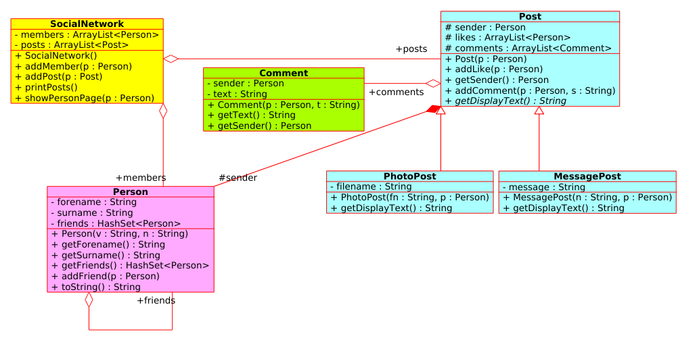

# AUfGABE

socialnetwork II

<section>

1. read: uml-socialnetwork2.png



---

1. given: main.cpp
2. code: person.h, ...  (see: CMakeLists.txt)
  
---

3. build

``` bash
mkdir build
cd build
cmake ..
make
./main
```

</section>
