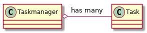

# AUFGABE

Taskmanager



<section>

1. Given file *tasklist.txt*

``` bash
4
2019.12.13 TODO cpp training
2019.12.14 DOING finish homework taskmanager.cpp
2019.12.08 DONE Football at 7:00 pm
2020.01.15 QUIZ cpp and oop
```

---

2. Create folder: taskmanager-SCHOOL

- add files `taskmanager.exe tasklist.txt`

``` bash
$ taskmanager-SCHOOL> ls
  - taskmanagment.exe
  - tasklist.txt
```

---

3. edit files

  - main.cpp
  - taskmanager.h/.cpp
  - task.h/.cpp

---

4. Usage of taskmanager.exe

``` bash
taskmanager.exe list
taskmanager.exe list TODO
taskmanager.exe del #
taskmanager.exe add "2019.12.24 TODO get present for susi"
```
---

5. Example

``` bash
$> taskmanagement.exe list
lists content of tasklist.txt with preceded Number of task
1 2019.12.13 TODO cpp training
2 2019.12.14 DOING finish homework taskmanager.cpp
3 2019.12.08 DONE Football at 7:00 pm
4 2020.01.15 QUIZ cpp and oop
```

6. build

``` bash
mkdir build
cd build
cmake ..
make
./taskmanager.exe
```

