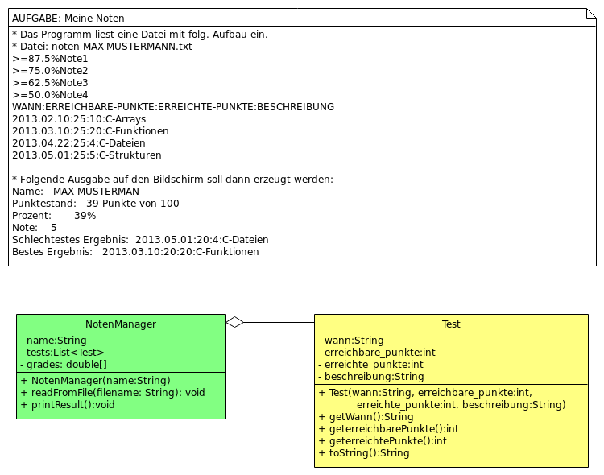

# AUFGABE

Notenmanager


<section>

1. Das Programm liest eine Datei mit folg. Aufbau ein.
2. Datei: noten-MAX-MUSTERMANN.txt 
 
```
>=87.5%Note1 
>=75.0%Note2 
>=62.5%Note3 
>=50.0%Note4 
WANN:ERREICHBARE-PUNKTE:ERREICHTE-PUNKTE:BESCHREIBUNG 
2013.02.10:25:10:C-Arrays 
2013.03.10:25:20:C-Funktionen 
2013.04.22:25:4:C-Dateien 
2013.05.01:25:5:C-Strukturen 
```

---

3. Folgende Ausgabe auf den Bildschirm soll dann erzeugt werden

``` bash
Name:         MAX MUSTERMAN
Punktestand:  39 Punkte von 100
Prozent:      39%
Note:         5
Schlechtestes Ergebnis: 2013.05.01:20:4:C-Dateien 
Bestes Ergebnis:        2013.03.10:20:20:C-Funktionen 
```

---

4. build

``` bash
mkdir build
cd build
cmake ..
make
./notenmanager.exe
```

---



</section>